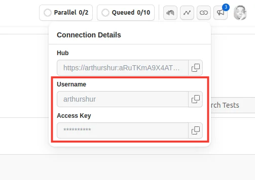
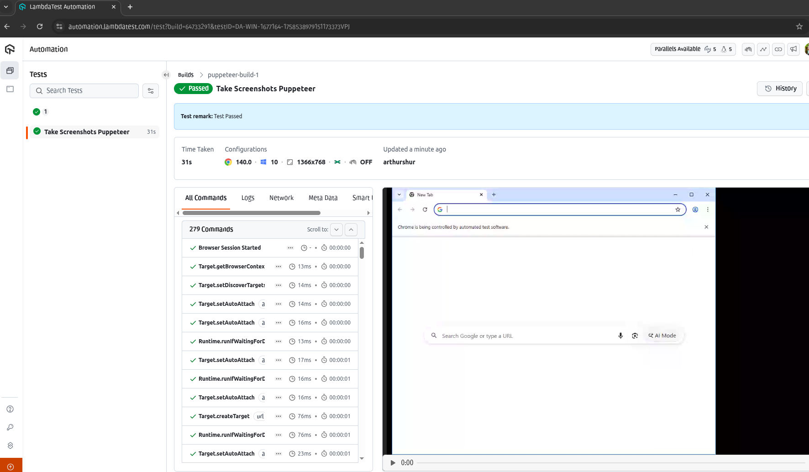

# Taking Screenshots with Puppeteer
Learn how to take screenshots using the Node.js automation framework Puppeteer. 
### Setup and Installation
Before you proceed, ensure that you have Node.js (LTS)/latest version and Node Package Manager (npm) installed on your computer.

Step 1: Clone this repository and navigate to the code directory as shown below:
```
    git clone https://github.com/inistack/take_screenshots_puppeteer
```
```
    cd take_screenshots_puppeteer
```
Step 2: Install the npm dependencies.
```
    npm install
```
### Authentication
Step 3: In order to run your Puppeteer on LambdaTest cloud you will need to set your LambdaTest username and access key in the environment variables. Click the Access Key button at the top-right of the Automation Dashboard to access it.



**Windows**
```
    set LT_USERNAME="YOUR_LAMBDATEST_USERNAME"
    set LT_ACCESS_KEY="YOUR_LAMBDATEST_ACCESS_KEY"
```
**Linux/macOS**
```
    export LT_USERNAME="YOUR_LAMBDATEST_USERNAME"
    export LT_ACCESS_KEY="YOUR_LAMBDATEST_ACCESS_KEY"
```
### Executing The Puppeteer Scripts
To the Puppeteer scripts in this repository on LambdaTest cloud plaform. 
Use the following command:
```
    node samples/screenshot.js 
```
### View your Puppeteer results
The LambdaTest Automation Dashboard is where you can see the results of your executed Puppeteer scripts on the LambdaTest platform.

The below screenshot of LambdaTest Automation Dashboard shows the Puppeteer build on the left and the build sessions associated with the selected build on the right.

